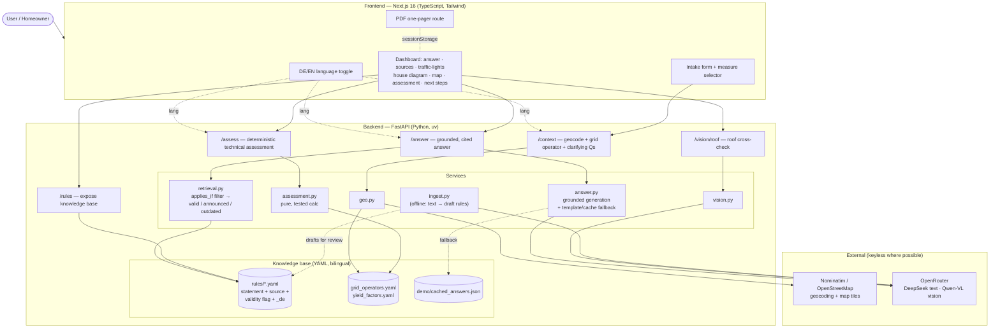
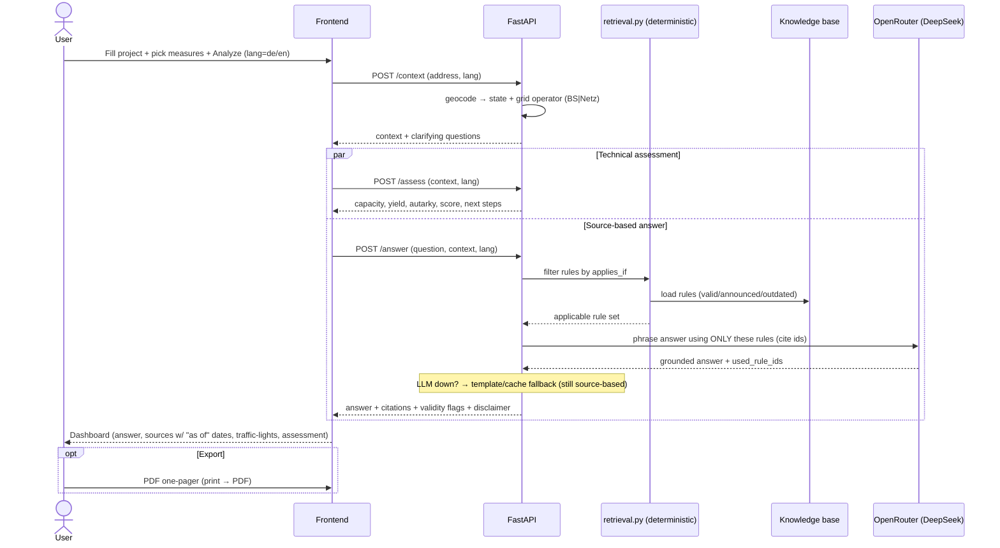

# System Architecture — KI-PV-Assistent

Source-based AI PV assistant: a **structured, cited knowledge base** + **deterministic retrieval**
+ **LLM only for phrasing** → traceable answers (not hallucinated), bilingual (DE/EN).

## High-level architecture

## Request flow (the core "Analyze" action)

## Why this design
- **Deterministic retrieval** (not the LLM) decides *which* rules apply → reproducible, testable, and
  the basis for the valid / announced / outdated distinction (Requirement 3).
- **LLM is grounded**: it phrases only over the retrieved rules and cites them; out-of-scope
  questions are flagged, never invented (anti-hallucination).
- **Graceful degradation**: no LLM key → deterministic template answer; network failure → demo cache.
- **Keyless geo**: Nominatim + OpenStreetMap, no Google key required.
- **Bilingual**: `lang` flows from the UI toggle through every endpoint; rules carry `_de` fields.

See [`spec.md`](spec.md) for component responsibilities and [`sources.md`](sources.md) for provenance.
